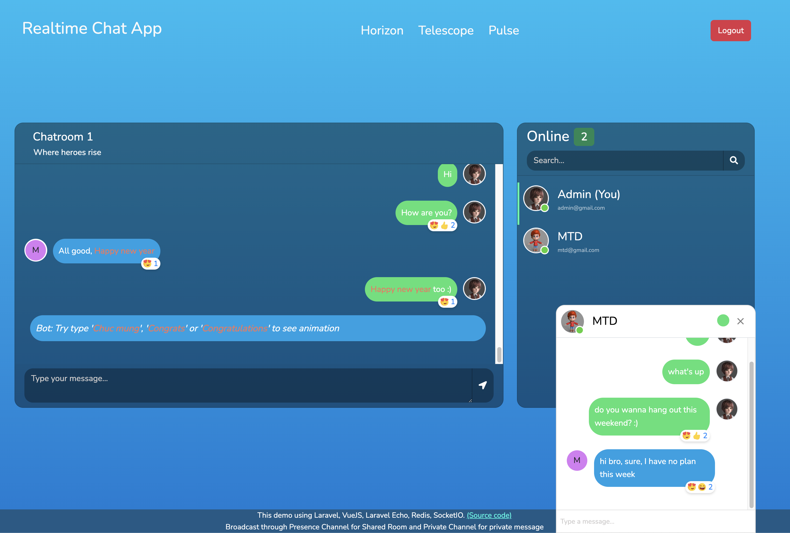
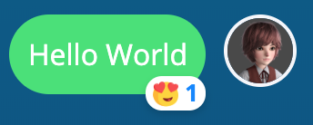
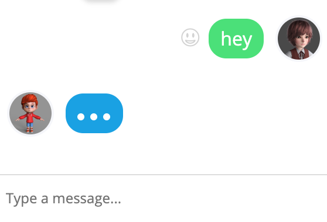
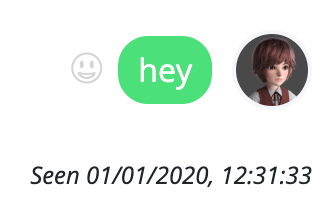
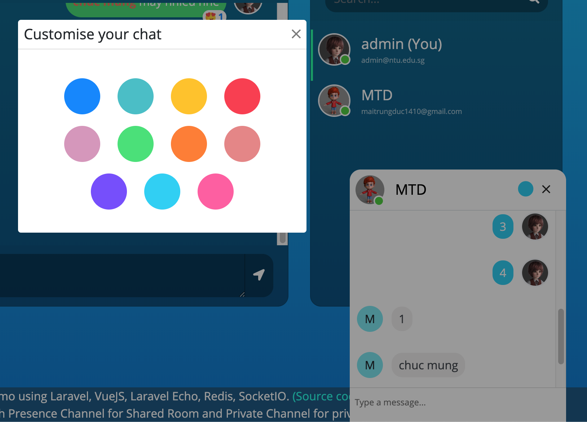
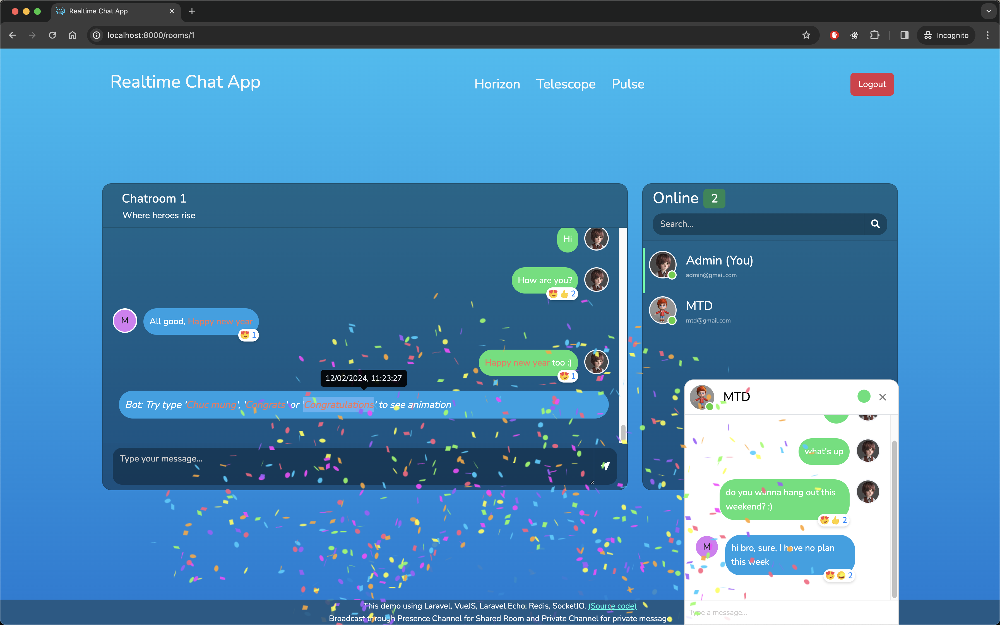
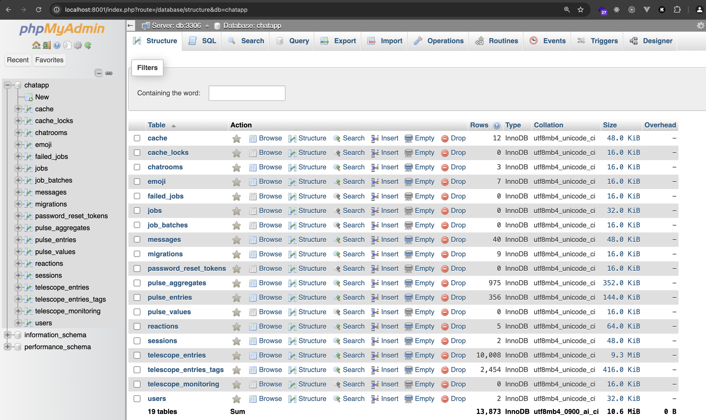
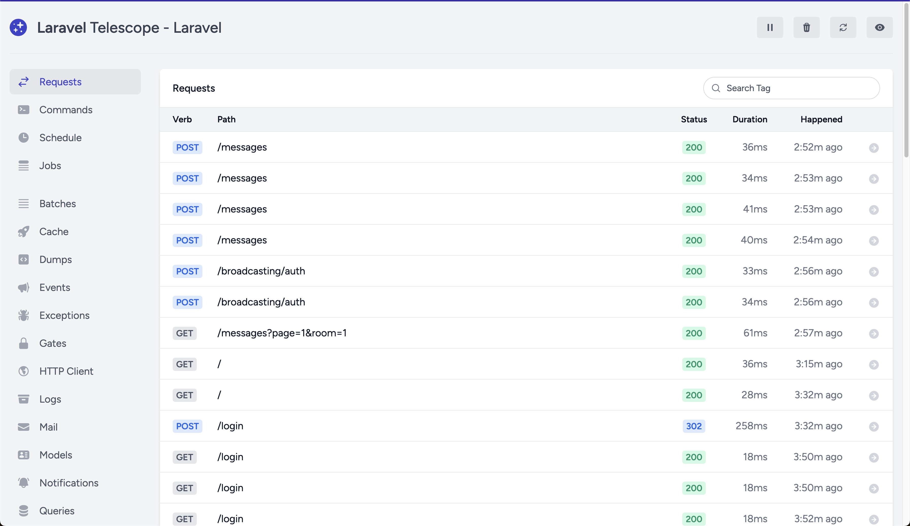
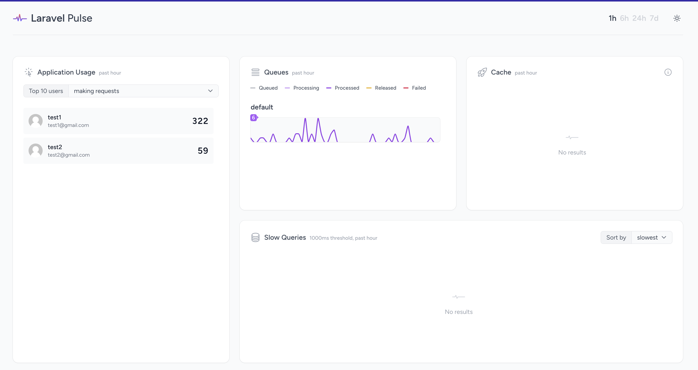

# Introduction
Realtime chat app with Laravel, VueJS, Laravel Echo, SocketIO, Redis including Queue, Schedule Task, Laravel Horizon, Laravel Telescope and Laravel Pulse

## Overview
This app contains following features:
- Multiple chat rooms
- Realtime chat with Private and Presence Channel
- Each room contains Share area (everyone can chat) or Private chat with a specific user in the room
- Bot scheduled message
- Message reaction like Facebook Messenger (Realtime notify others on reaction)
- Confetti Celebration animation
- Change message color (private chat)
- phpMyAdmin - database management
## Screenshots

