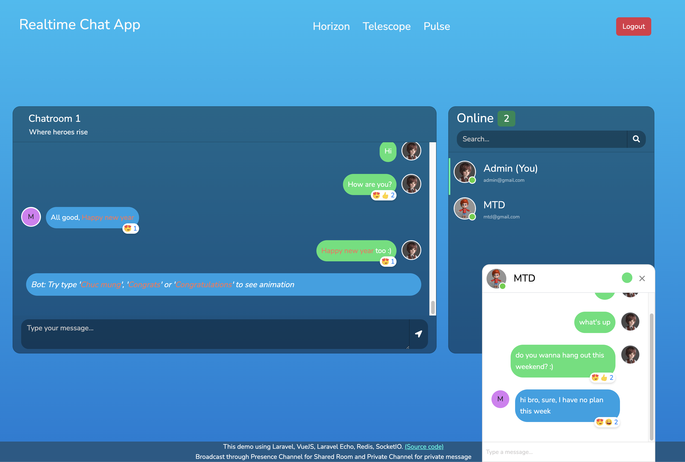
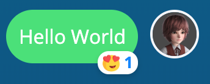
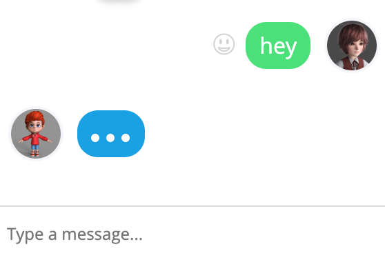
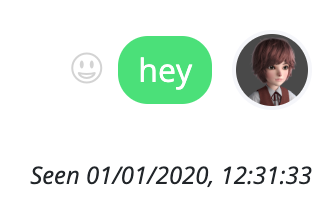
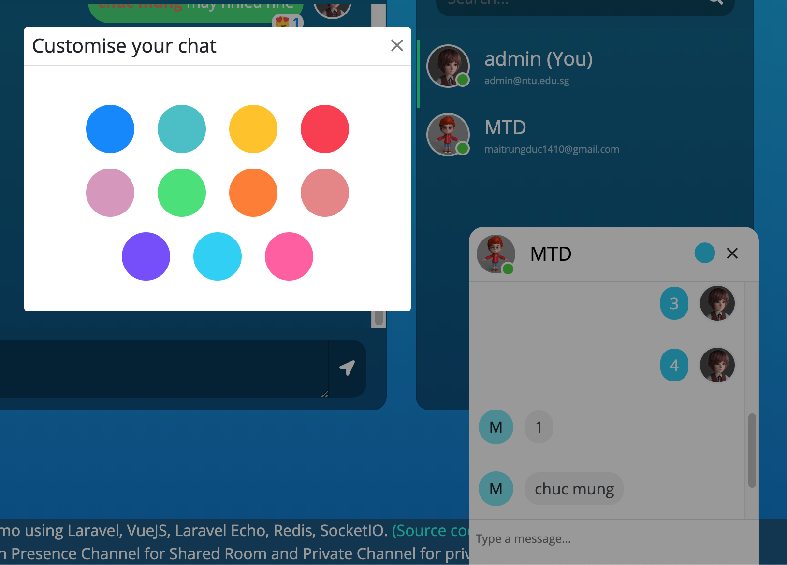
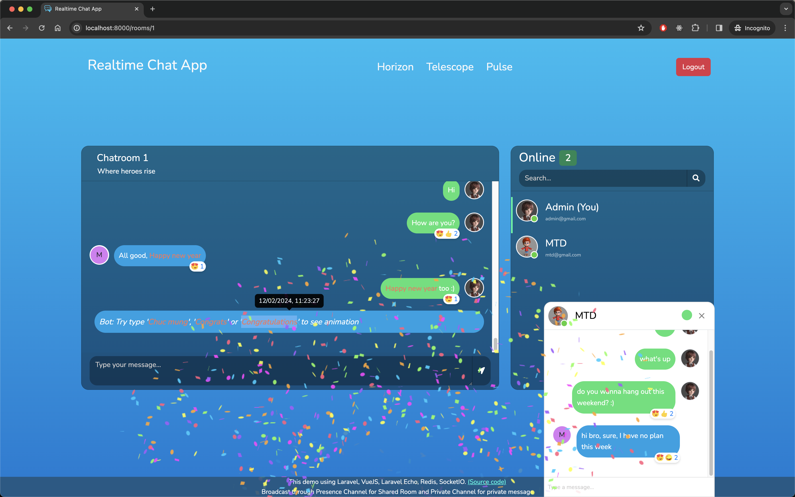
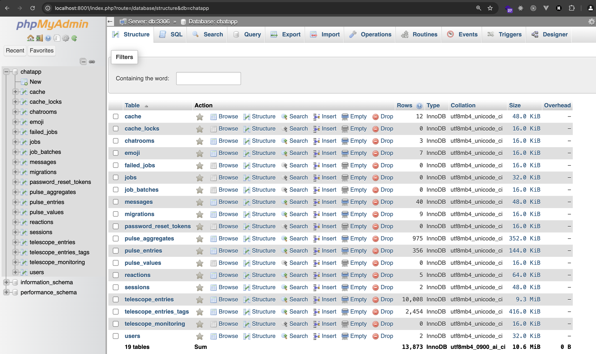
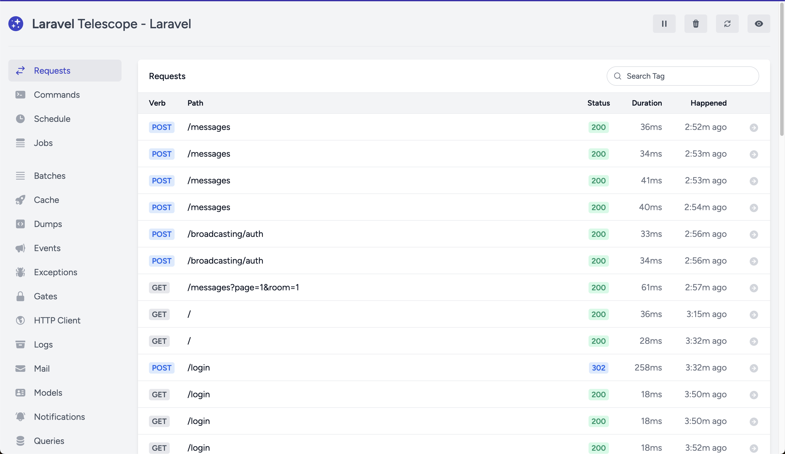
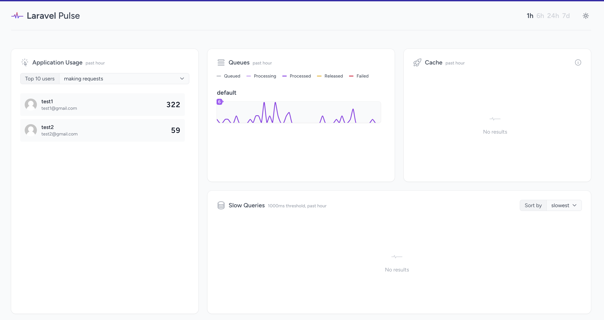

# Introduction
Realtime chat app with Laravel, VueJS, Laravel Echo, SocketIO, Redis including Queue, Schedule Task, Laravel Horizon, Laravel Telescope and Laravel Pulse

## Overview
This app contains following features:
- Multiple chat rooms
- Realtime chat with Private and Presence Channel
- Each room contains Share area (everyone can chat) or Private chat with a specific user in the room
- Bot scheduled message
- Message reaction like Facebook Messenger (Realtime notify others on reaction)
- Confetti Celebration animation
- Change message color (private chat)
- phpMyAdmin - database management

## 🔄 CI/CD Pipeline

Our deployment follows a comprehensive DevSecOps approach using GitHub Actions:

### Pipeline Stages

#### 1. **Notification & Setup**
- Slack notification for deployment start

#### 2. **Security Scanning**
- **SCA (Software Composition Analysis)**: Snyk scans dependencies for vulnerabilities (Medium+ severity)
- **SAST (Static Application Security Testing)**: Snyk Code analyzes source code for security issues (Medium+ severity)
- Results uploaded to GitHub Security tab

#### 3. **Build & Push**
- Build Docker images with Git SHA tags
- Push to AWS ECR repository
- Tag both specific version and latest

#### 4. **Container Security**
- **Trivy Image Scanning**: Scans Docker images for vulnerabilities (Critical, High, Medium)
- SARIF results uploaded to GitHub Security

#### 5. **GitOps Deployment**
- Update image tags in GitOps repository

#### 6. **Post-Deployment Testing** 
- **DAST (Dynamic Application Security Testing)**: OWASP ZAP baseline scan
- **Performance Testing**: K6 load testing (10 VUs, 30s duration)
- Results archived as artifacts

#### 7. **Notifications**
- Slack notifications for success, failure, or cancellation
- Deployment status tracking

### Security Features
- **Threshold-based scanning**: Only Medium+ severity vulnerabilities reported
- **Multi-layer security**: SCA, SAST, Container scanning, and DAST
- **Automated vulnerability management**: Results integrated with GitHub Security

### Deployment Strategy
- **GitOps Approach**: Infrastructure and application state managed through Git
- **ArgoCD Integration**: Automated Kubernetes deployments
- **Automated Rollback**: Failure detection and automatic rollback
- **Multi-environment**: Staging and production pipelines

## Screenshots

